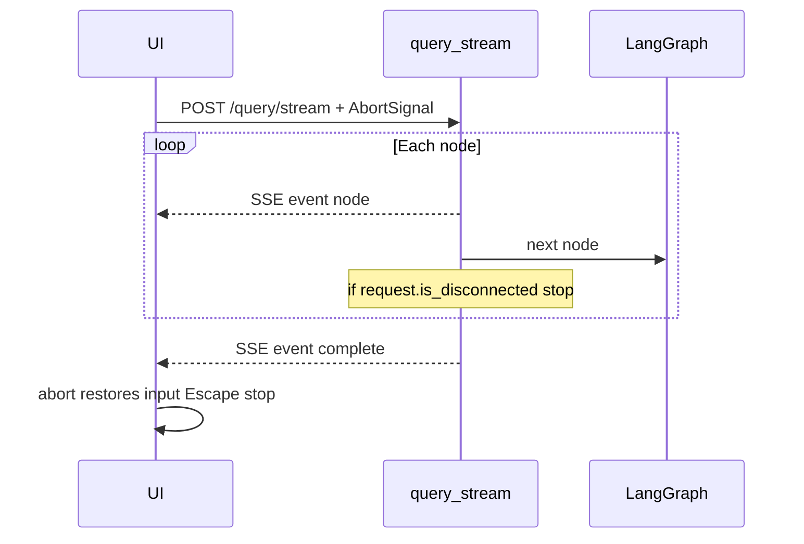

# Chat stop button + SSE streaming (Phase 1)

## Reality check
- Chat is [`POST /query`](app/api/routes_query.py) → sync `run_pipeline` / `graph.invoke` in [`app/agents/graph.py`](app/agents/graph.py)
- LLM is non-streaming [`complete()`](app/llm/client.py) (`stream: False`)
- UI [`ask()`](app/static/app.js) waits on full JSON with a static “Thinking…” bubble — no AbortController, stop button, or progress widget
- Composer has **no send button** (Enter-only)

Phase 1 delivers **pipeline-progress SSE + cancel between nodes**. Mid-token answer cancellation is deferred until LLM streaming is added (answer node still runs atomically once started).

## Architecture

## Backend
**Additive endpoint** in [`app/api/routes_query.py`](app/api/routes_query.py) (do not break `POST /query`):

- `POST /query/stream` → `StreamingResponse` (`text/event-stream`)
- Helper `_sse(event, data)` → `event: …\ndata: …\n\n`
- Runner uses `graph.stream(initial)` (or thin wrapper in [`app/agents/graph.py`](app/agents/graph.py) e.g. `run_pipeline_stream`) and after each node:
  - `if await request.is_disconnected(): yield aborted; return`
  - emit `{node, status, label, …}` for: `classify`, `retrieve`, `escalate` / `create_ticket` / `answer` as applicable
- Final `complete` payload mirrors current `QueryResponse` fields used by the UI (`answer`, `department`, `severity`, `sources`, `cached`, `model_used`, `ticket_id`, …)
- Preserve existing pre-graph path: semantic cache hit → emit `cache_check` done + `complete` without running the graph
- On abort: **skip** audit/cache write for incomplete runs; on success keep same audit/chat-persist behavior as `/query`
- Auth/session/enforcement: same as `/query`

SSE event shapes:
- `node` — `{node, status: active|done, label?, dept?, ms?}`
- `complete` — full answer payload
- `aborted` — `{message}`
- `error` — `{message}`

## Frontend ([`app/static/app.js`](app/static/app.js), [`index.html`](app/static/index.html), [`styles.css`](app/static/styles.css))
- Add composer **send** control that becomes a **stop** control while in flight (pulse styling)
- `AbortController` per KB ask; `signal` on fetch to `/query/stream`
- Parse SSE (`ReadableStream` + `TextDecoder`); update a **pipeline progress card** from `node` events (replace static Thinking bubble)
- On `complete`: remove progress, `addBubble` answer, `showMeta`
- On stop / Escape / `aborted`: cancel fetch, restore query into `#chat-input`, brief “Stopped” note, re-enable composer
- **NLP / document** modes: same stop button + `AbortController` on existing JSON fetches (cancel wait); no SSE required in Phase 1

## Out of Phase 1
- Token-by-token LLM streaming / mid-sentence cancel inside `answer`
- Rewriting NLP/document pipelines as SSE

## Tests
- Unit: `_sse` formatting; stream runner emits expected node sequence with a stub graph / mocked nodes
- Abort: disconnect after classify → no answer call / no cache write (mock)
- Frontend: light JS not required if manual; keep pytest focused on backend stream + disconnect

## Build order
1. `run_pipeline_stream` + SSE helpers + `POST /query/stream`
2. Composer send/stop + AbortController + Escape + input restore
3. Progress card wired to SSE `node` events
4. Wire stop to NLP/doc fetches
5. Tests for stream events + abort-before-answer
