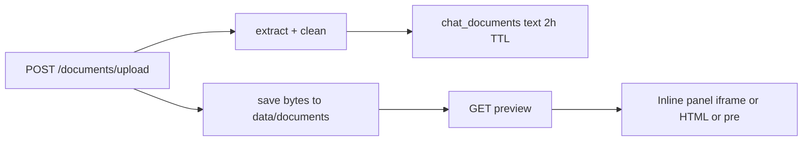

# Document file storage + inline preview

## Locked decisions

- **DOCX preview:** mammoth → HTML (no LibreOffice)
- **File retention:** 7 days on disk; **extracted text** stays on existing 2h SQLite TTL (`[DOCUMENT_TTL_SECONDS](app/config.py)`)
- **Storage:** local disk `data/documents/{session_id}/{doc_id}_{safe_filename}`
- **Scope:** PDF / DOCX / TXT only (no XLSX in this phase)
- **Text store:** keep SQLite `[chat_documents](app/documents/session_store.py)` — not Redis

## Data flow

## Backend

### 1. `[app/documents/storage.py](app/documents/storage.py)`

- `save_file(session_id, doc_id, filename, bytes) -> Path`
- `get_file_path(...)` / `delete_session_files(session_id)` / `delete_file(...)`
- Sanitize filename; config `DOCUMENT_STORAGE_DIR` default `./data/documents`
- `cleanup_old_document_files(max_age_days=7)` — delete session dirs older than cutoff

### 2. `[app/documents/preview.py](app/documents/preview.py)`

- `preview_kind(filename) -> pdf | html | text`
- DOCX: `mammoth.convert_to_html` → HTML string (sanitized basic wrapper)
  - PDF/TXT: serve original file via `FileResponse`

### 3. Schema + session store

Extend `chat_documents` with:

- `stored_path TEXT` (relative path under storage dir)
- `preview_kind TEXT` (`pdf` | `html` | `text`)
- `file_expires_at TEXT` (created + 7 days)

On upsert: write bytes to disk; delete previous session files when replacing the one active doc. On text-row purge (2h), **do not** necessarily delete disk immediately — disk cleanup is age-based (7d) so Preview can outlive analyze ops; if text expired, analyze still 404s but preview may work until file TTL (or require both — **require SQLite row still owned by user for preview auth**, so if text row gone preview 404s unless we keep a lightweight meta row).

**Chosen approach:** keep meta row fields above; when text TTL expires, null out `text` but keep meta + `stored_path` until `file_expires_at` so Preview still works for 7 days while analyze requires non-null text. Simpler alternative that avoids schema complexity: **same 7d for meta+file**, keep text in DB for 7d too for preview/analyze consistency — but user asked text TTL stay 2h.

Implement: `text_expires_at` (2h) vs `file_expires_at` (7d); `get_active_document(include_text=True)` returns text only if not text-expired; preview uses meta + ownership + file on disk.

### 4. API (`[app/api/routes_documents.py](app/api/routes_documents.py)`)

- Upload: after extract, `save_file(...)`; store path + preview_kind on row
- `GET /documents/preview?session_id=&doc_id=` (or path style) — **CurrentUser**; verify `user_email` owns session row; PDF/TXT `FileResponse` inline; DOCX return `HTMLResponse` from mammoth (or cached `.preview.html` beside file)
- Optional `DELETE /documents/active` — clear SQLite + disk for session

Auth: never serve by path alone without ownership check.

### 5. Cleanup

- Call `cleanup_old_document_files(7)` on upload/read and/or app lifespan in `[app/main.py](app/main.py)`
- When replacing one-doc-per-session, delete prior files under that session dir

### 6. Deps

- `mammoth` in `[requirements.txt](requirements.txt)`
- Config: `DOCUMENT_STORAGE_DIR`, `DOCUMENT_FILE_TTL_DAYS=7`

## Frontend

- Extend options card with **Preview** toggle (`[renderDocOptionsCard](app/static/app.js)`)
- Expand inline panel (~500px, scroll):
  - PDF: `<iframe src="/documents/preview?...">` with auth — **iframe cannot send Bearer header**. Fix: use `fetch` blob URL with `Authorization`, then `iframe.src = blobUrl` (or cookie-less query is bad). **Use authenticated fetch → blob URL for PDF/TXT; innerHTML for DOCX HTML from JSON/HTML endpoint.**
- Prefer: `GET /documents/preview` returns PDF/TXT as file; JS `fetch`+blob. For DOCX, `GET /documents/preview` returns `text/html` body; inject into sandboxed iframe `srcdoc` or div.
- Close collapses panel; chat continues below

## Tests

- `save_file` / path sanitize / replace deletes old
- Preview ownership 403 for other user
- mammoth HTML for tiny docx fixture
- cleanup removes dirs older than 7 days (mtime monkeypatch)

## Build order

1. storage.py + config + schema columns
2. Wire upload to save bytes
3. preview.py + GET preview (auth + ownership)
4. UI Preview button + panel (blob/iframe/srcdoc)
5. cleanup job + tests

