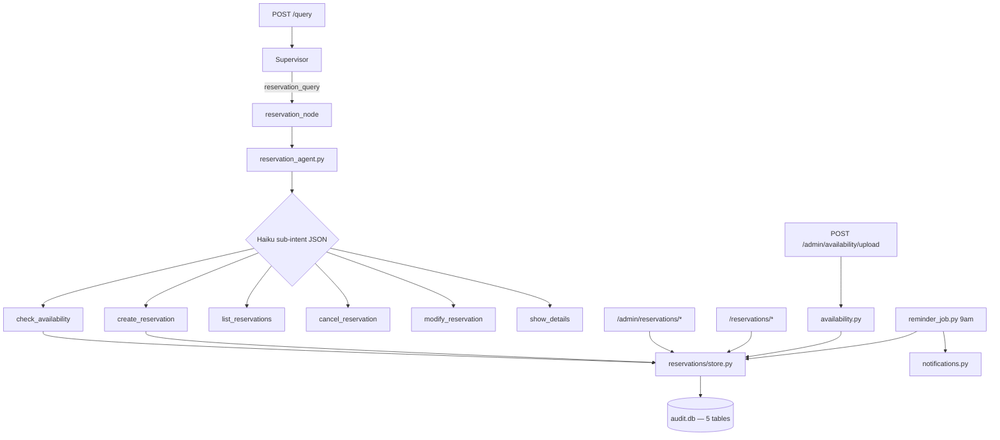
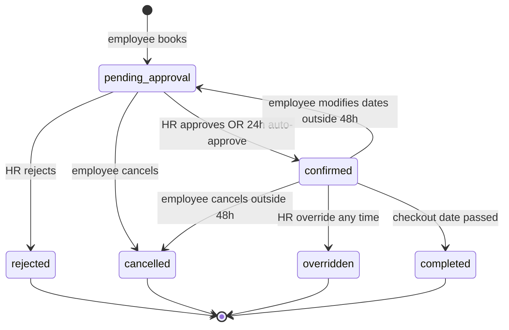

# Guesthouse Reservation Module

## Current state

- **Supervisor** already routes `reservation_query` → [`reservation_stub_node`](app/agents/supervisor_nodes.py) (“coming soon”).
- **My Workspace** has a Guesthouse card marked coming soon in [`index.html`](app/static/index.html).
- **No** `app/reservations/` package, no openpyxl, no reservation tables in DB.
- Your **db layer sketch is validated** (tests you listed); it must be **adapted** to this repo — not a separate `data/helpdesk.db`, but the shared [`audit.db`](app/audit/db.py) via `app.audit.db.connect()` (same pattern as [`app/onboarding/store.py`](app/onboarding/store.py)).

## Architecture



## Pending SLA (confirmed)

**24h auto-approve** when HR does not act on `pending_approval` (use `auto_approve_at` from your db sketch via `get_reservations_due_auto_approve()`). Do **not** auto-expire pending at 48h. Keep `expired` status only for explicit/system edge cases if needed later.

## Data model

Add to [`app/audit/db.py`](app/audit/db.py) `_SCHEMA` + migration helper (same style as `pending_ticket_json`):

| Table | Notes |
|-------|--------|
| `guesthouses` | Seed: **4656 Westfield Blvd**, **4050 Westfield Blvd** (Bloomington) |
| `rooms` | 2 rooms per property; omit optional `floor` unless needed |
| `availability` | `UNIQUE(room_id, date)`; sparse rows OK (missing date = available) |
| `reservations` | Full state machine + notification flags + `auto_approve_at` |
| `reservation_audit` | Append-only |

**Package layout** (repo uses `app/`, not `backend/`):

```
app/reservations/
  __init__.py
  store.py           ← your db.py logic (CRUD, state changes, queries)
  availability.py    ← Excel parse, conflict detect, resolve, apply
  confirmation.py    ← GH-YYYY-NNNN, chat formatting helpers
  reservation_agent.py
  notifications.py   ← 9 email templates via app.audit.emailer.send_email
  reminder_job.py    ← daily 9am loop (mirror onboarding)
app/api/routes_reservations.py
```

Port your provided `db.py` into `store.py` with these repo adjustments:

- Replace `get_conn()` / `DB_PATH` with `from app.audit.db import connect, init_audit_db`
- Use `hr@ampcus.com` / `settings.onboarding_hr_email` instead of `hr@company.com`
- Wire `create_tables()` + `seed_guesthouses()` from [`app/main.py`](app/main.py) lifespan (after `init_audit_db()`)
- Extract shared **`can_modify(reservation)`** used by both API and agent (48h cutoff on **confirmed** only; pending cancel allowed without cutoff)

## State machine



**48h rule** — enforced in `store.cancel_reservation`, `store.modify_reservation`, and `reservation_agent` handlers; HR `override_reservation` bypasses it.

**Modify flow** — free old dates, book new, status → `pending_approval`, reset approval fields, new `auto_approve_at`.

## Reservation Agent ([`reservation_agent.py`](app/reservations/reservation_agent.py))

Replace [`RESERVATION_STUB_ANSWER`](app/agents/supervisor_nodes.py) with real `reservation_node` calling `handle_reservation_query()`.

**Sub-intent detection** — Haiku JSON (same pattern as [`app/agents/supervisor.py`](app/agents/supervisor.py)), scoped prompt with **today's date** for relative dates (“next Tuesday”):

```json
{
  "sub_intent": "create_reservation",
  "guesthouse_name": "4656 Westfield Blvd",
  "room_number": "1",
  "checkin_date": "2026-08-12",
  "checkout_date": "2026-08-14",
  "purpose": null,
  "confirmation_number": null
}
```

**Keyword fallback** when no API key (mirror supervisor `_keyword_fallback`).

| Sub-intent | Handler | LLM for answer? |
|------------|---------|-----------------|
| `check_availability` | `get_room_availability_calendar` / grid formatter | No — template grid |
| `create_reservation` | Multi-turn: dates → purpose → confirm → `create_reservation` | Sub-intent only |
| `list_reservations` | `get_upcoming_reservations` | No |
| `cancel_reservation` | Match by conf # or “my booking”; enforce 48h | No |
| `modify_reservation` | New dates + re-approval | No |
| `show_details` | `get_guesthouse_with_rooms` | No |

**Multi-turn booking state** — add `pending_reservation_json` on `chat_sessions` (same pattern as [`app/chat/pending_ticket.py`](app/chat/pending_ticket.py)) storing `{step, guesthouse_id, room_id, checkin, checkout, purpose?}`. Clear on submit/cancel/new unrelated message.

**Graph change** in [`app/agents/graph.py`](app/agents/graph.py): rename route target `reservation_stub` → `reservation`; update [`tests/test_supervisor_graph.py`](tests/test_supervisor_graph.py).

## Excel upload ([`availability.py`](app/reservations/availability.py))

- Add **`openpyxl`** to [`requirements.txt`](requirements.txt)
- `POST /admin/availability/upload` — multipart file, parse rows: guesthouse name, room number, date_from, date_until, status
- For each date in range:
  - **Case 1** available / no row → apply
  - **Case 2** booked (confirmed) → **conflict**, do not apply
  - **Case 3** booked (pending) → **conflict**
- Return `{ applied: N, conflicts: [...] }`
- `POST /admin/availability/resolve` — HR picks per conflict: skip or override reservation (calls `override_reservation` + apply Excel status)

## Notifications ([`notifications.py`](app/reservations/notifications.py))

Reuse [`app/audit/emailer.send_email`](app/audit/emailer.py) + [`app/tickets/notify.py`](app/tickets/notify.py) patterns (admin recipient list, `app_base_url()`).

| # | Event | Recipient |
|---|-------|-----------|
| 1–7 | Employee: submitted, confirmed, rejected, overridden, 48h, check-in day, checkout | employee_email |
| 8 | HR approval needed | onboarding_hr_email / admin emails |
| 9 | Excel conflict summary | HR |

Fire from: create/approve/reject/override/cancel handlers + [`reminder_job.py`](app/reservations/reminder_job.py).

## Reminder job ([`reminder_job.py`](app/reservations/reminder_job.py))

Mirror [`app/onboarding/reminder_job.py`](app/onboarding/reminder_job.py):

- Register loop in [`app/main.py`](app/main.py) `_reservation_reminder_loop` at `settings.reservation_reminder_hour` (default 9)
- Each run:
  - `get_reservations_due_auto_approve()` → approve as system/HR-auto
  - `get_reservations_needing_reminders()` → send 48h / check-in / checkout emails + `mark_notified`
  - `mark_completed_reservations()` → status `completed`

Add config keys to [`app/config.py`](app/config.py): `reservation_hr_email`, `reservation_reminder_hour`, `reservation_reminder_poll_seconds`, `reservation_auto_approve_hours` (default 24).

## API ([`routes_reservations.py`](app/api/routes_reservations.py))

**Employee** (`CurrentUser`):

- `GET /reservations/availability?guesthouse_id&checkin&checkout`
- `POST /reservations` — body: room_id, checkin, checkout, purpose
- `GET /reservations/my`
- `PUT /reservations/{id}` — new dates (48h + availability checks)
- `DELETE /reservations/{id}` — cancel

**Admin** (`AdminUser` — HR actions; agents read-only optional later):

- Guesthouses CRUD + add rooms
- Availability upload + resolve conflicts + calendar GET
- Reservations list/calendar, approve, reject, override
- `GET /admin/reservations/report` — occupancy from `get_occupancy_report`

**Schemas** — extend [`app/models/schemas.py`](app/models/schemas.py) with Pydantic models for all request/response shapes.

Register router in [`app/main.py`](app/main.py).

## UI (Week 3)

**My Workspace** — replace Guesthouse “coming soon” in [`index.html`](app/static/index.html) + [`app.js`](app/static/app.js):

- Upcoming reservations list (from `GET /reservations/my`)
- Cancel button (calls DELETE; show 48h error inline)

**Admin** (minimal v1):

- Pending approvals table with Approve/Reject
- Excel upload + conflict resolution panel
- Optional: simple calendar list view (defer full calendar widget if time-constrained)

Chat **Modify/Cancel** buttons in bot bubbles optional v2; v1 via natural language + API.

## Tests

| File | Coverage |
|------|----------|
| `tests/test_reservations_store.py` | Port your 12 unit tests against `store.py` |
| `tests/test_reservations_availability.py` | Excel parse, conflict cases 1–3, resolve |
| `tests/test_reservations_agent.py` | Sub-intent fallback, 48h block messages, grid format |
| `tests/test_reservations_api.py` | Employee book → admin approve → email hooks mocked |
| `tests/test_supervisor_graph.py` | Update reservation stub test → real flow smoke |

## Build order (3 weeks)

### Week 1 — Foundation
1. Schema + `store.py` + seed + store unit tests
2. `availability.py` + openpyxl + conflict tests
3. `confirmation.py` + `notifications.py` templates (mock SMTP)

### Week 2 — Agent + employee API
4. `reservation_agent.py` + pending conversation state + graph wire-up
5. Cancel/modify + 48h enforcement tests
6. Employee REST endpoints + My Workspace list

### Week 3 — Admin + automation
7. Admin endpoints (approve/reject/override/upload/resolve)
8. `reminder_job.py` + main.py loop + auto-approve at 24h
9. Admin UI (approvals + upload) + integration tests

## Key files to modify

- [`app/audit/db.py`](app/audit/db.py) — 5 tables + indexes
- [`app/agents/graph.py`](app/agents/graph.py) + [`supervisor_nodes.py`](app/agents/supervisor_nodes.py) — replace stub
- [`app/main.py`](app/main.py) — seed, reminder loop, router
- [`app/static/index.html`](app/static/index.html) + [`app.js`](app/static/app.js) — workspace guesthouse panel
- [`requirements.txt`](requirements.txt) — `openpyxl`

## Out of scope (v1)

- Separate HR role (use `admin` + `onboarding_hr_email`)
- Dedicated onboarding-style KB for guesthouses (reservations are DB-driven, not RAG)
- Auto-expire pending at 48h (using **24h auto-approve** per your choice)
- `skip_supervisor` fix for nested `run_pipeline` in onboarding (unrelated)
