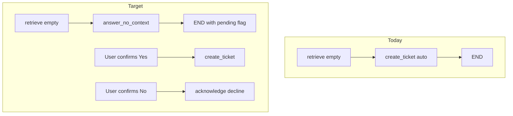

# KB Miss UX + Confirm-Before-Ticket

## Current state

| Item | Status |
|------|--------|
| **Fix 3 — Supervisor entry** | **Already done** in [`app/agents/graph.py`](app/agents/graph.py): `START → supervisor → route_after_supervisor`. No re-wiring needed; only verify tests still pass. |
| **Fix 2 — No-context answer** | **Not done**. Empty retrieval currently routes to [`create_ticket_node`](app/agents/ticket.py) which auto-creates a ticket and returns an internal ops message. [`answer_node`](app/agents/answer.py) still has an empty-chunks fallback (`NO_CONTEXT_ANSWER`) that should no longer be hit from the graph. |
| **Confirm-before-ticket** | **Not done**. [`route_after_retrieve`](app/agents/graph.py) sends exhausted retries straight to `create_ticket → END`. |



---

## Fix 2 — Dedicated `answer_no_context` node

**New file:** [`app/agents/answer_no_context.py`](app/agents/answer_no_context.py)

- Add `DEPARTMENT_CONTACTS` map (config-driven or constants):
  - `hr → hr@ampcus.com`, `it → it@ampcus.com`, `compliance → compliance@ampcus.com`, `legal → legal@ampcus.com`, `unknown → helpdesk@ampcus.com`
- Implement `answer_no_context_node(state)`:
  - Read `department`, `severity`, `query` from state
  - Build a **template response** (no LLM needed for reliability):
    ```
    I couldn't find information about this in our knowledge base.
    For {dept_label} questions, please contact {contact}.
    You can also try rephrasing your question differently.
    ```
  - **High severity** variant (classifier still sets `severity=high`): add urgency line — e.g. *"This looks time-sensitive — I recommend opening a support ticket so the team can respond quickly."*
  - Append confirmation prompt: *"Would you like me to open a support ticket for human review?"*
  - Set state flags: `pending_ticket_confirmation=True`, `kb_miss_query=query`, `model_used="no_context"`, `context_used=False`, `ticket_id=None`
  - Do **not** call `create_ticket` here

**Graph changes** in [`app/agents/graph.py`](app/agents/graph.py):

- Replace `route_after_retrieve → create_ticket` with `→ answer_no_context`
- Add node `answer_no_context`; edge `answer_no_context → END` (skip semantic cache write — nothing to cache)
- Keep `create_ticket` node but only reachable from confirmation handler (see below)

**Cleanup** in [`app/agents/answer.py`](app/agents/answer.py):

- Remove or guard the `if not chunks:` early return in `generate_answer()` — graph should never route empty chunks to `answer`. Add a defensive log if it happens.

**Escalation path change:** Today `retrieve → escalate → answer` auto-creates an escalation ticket in [`escalate_node`](app/agents/escalate.py). Change to:

- `retrieve (has chunks, high severity) → escalate` sets `escalated=True` + internal reason **without** calling `create_ticket`
- Then route to `answer` (grounded answer with escalation context) **or** if no chunks after retries, `answer_no_context` with high-severity messaging
- Ticket creation deferred until user confirms (same pending flow)

Split [`create_ticket_node`](app/agents/ticket.py) into:
- `build_kb_miss_ticket(state)` — shared ticket creation logic
- `create_ticket_node` — called only after confirmation

---

## Confirm-before-ticket (all ticket types)

### Session-scoped pending state

**Extend** [`chat_sessions`](app/audit/db.py) with nullable column `pending_ticket_json TEXT` (migration in `init_audit_db`).

**New helpers** in [`app/chat/pending_ticket.py`](app/chat/pending_ticket.py):
- `save_pending(session_id, payload)` — stores `{question, normalized_query, department, severity, reason, attempted_depts, ticket_type}`
- `get_pending(session_id) → dict | None`
- `clear_pending(session_id)`

Payload written when `answer_no_context_node` completes; cleared on confirm/decline/expiry.

### API layer — [`app/api/routes_query.py`](app/api/routes_query.py)

**Before** `run_pipeline()`:

1. Load `pending = get_pending(session_id)`
2. If `req.confirm_ticket is True` and pending exists → call ticket creation directly (reuse ticket builder), return confirmation answer with `ticket_id`, clear pending
3. If `req.confirm_ticket is False` → return polite decline (*"No problem — contact {dept} if you need help."*), clear pending
4. If pending exists and user sends a new unrelated message (no `confirm_ticket`) → treat as implicit decline: clear pending, proceed with normal pipeline on the new question

**Schema** updates in [`app/models/schemas.py`](app/models/schemas.py):

```python
# QueryRequest
confirm_ticket: Optional[bool] = None  # True=create, False=decline

# QueryResponse
pending_ticket_confirmation: bool = False
```

Map `pending_ticket_confirmation` from pipeline result in `_result_to_response()`.

**Extend** [`HelpdeskState`](app/agents/state.py): `pending_ticket_confirmation: bool`, `kb_miss_query: Optional[str]`

### UI — [`app/static/app.js`](app/static/app.js) + [`index.html`](app/static/index.html)

When `data.pending_ticket_confirmation === true`:
- Render bot bubble with inline **Yes, open ticket** / **No thanks** buttons (same pattern as existing doc-KB confirm)
- Button clicks POST `/query` with `{ confirm_ticket: true|false, session_id, question: "(confirm)" }` — question can be a sentinel; backend uses pending payload for the real question
- Do not show ticket IDs or internal ops text in chat (backend logs only, per prior request)

Bump `app.js` cache-bust version.

---

## Fix 3 — Supervisor entry (verification only)

Already implemented:

```127:127:app/agents/graph.py
    graph.add_edge(START, "supervisor")
```

**Action:** Run existing supervisor + integration tests; no graph re-wiring unless a test reveals regression.

**Optional follow-up** (out of scope unless needed): [`onboarding_agent.handle_onboarding_query`](app/onboarding/onboarding_agent.py) calls `run_pipeline()` internally, which re-enters the supervisor. Add a `skip_supervisor=True` flag on internal helpdesk-only subgraph calls to avoid double-routing (e.g. I-9 questions misrouted when outside onboarding window).

---

## Tests to update/add

| Test file | Change |
|-----------|--------|
| [`tests/test_core.py`](tests/test_core.py) | `route_after_retrieve` exhausted retries → `answer_no_context` (not `create_ticket`) |
| [`tests/test_integration.py`](tests/test_integration.py) | `test_query_unknown_creates_ticket` → two-step: (1) KB miss returns `pending_ticket_confirmation=true`, no `ticket_id`; (2) confirm → ticket created |
| New `tests/test_kb_miss_confirm.py` | Decline path clears pending; high-severity still sets `severity=high` in pending payload; confirm creates escalation vs unknown ticket types |
| [`tests/test_supervisor_graph.py`](tests/test_supervisor_graph.py) | Re-run as regression for Fix 3 |

---

## Files touched (summary)

- **New:** `app/agents/answer_no_context.py`, `app/chat/pending_ticket.py`, `tests/test_kb_miss_confirm.py`
- **Modify:** `app/agents/graph.py`, `app/agents/answer.py`, `app/agents/ticket.py`, `app/agents/escalate.py`, `app/agents/state.py`, `app/api/routes_query.py`, `app/models/schemas.py`, `app/audit/db.py`, `app/static/app.js`, `app/static/index.html`
- **Verify only:** `app/agents/supervisor.py`, `app/agents/supervisor_nodes.py` (Fix 3)
