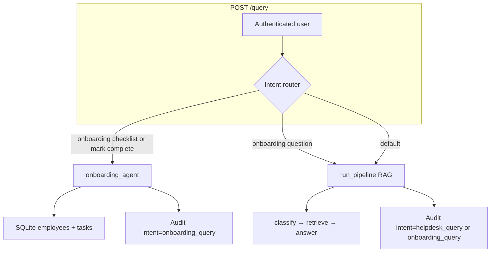

# Onboarding Module — Complete Implementation Plan

## Confirmed decisions

| Decision | Choice |
|----------|--------|
| Department template keys | Exactly `engineering`, `data`, `hr`, `sales`, `compliance`, `legal` (stored lowercase; reject unknown departments at employee create) |
| Reminder emails | **One email per day** listing all incomplete tasks |
| `GET /me/tasks` | **Own tasks only** in MVP (no manager report view) |

---

## Architecture (how it fits the existing app)

There is **no Manager Agent** in this codebase today. LangGraph routes by **department + severity + KB chunks** ([`app/agents/graph.py`](app/agents/graph.py)). Onboarding will use a **pre-graph intent router** in [`app/api/routes_query.py`](app/api/routes_query.py) — the same pattern as the NLP vs KB split in the UI, but unified on `/query`.



**Auth vs employee records:** Login accounts live in [`data/users.json`](app/auth/users.py) (JWT). Onboarding profiles live in new SQLite `employees` table keyed by **email**. An employee must have both: HR creates the onboarding record; auth account must exist with the same email (see Step 3).

**Database home:** Add tables to [`app/audit/db.py`](app/audit/db.py) `_SCHEMA` (same pattern as `chat_documents`, `user_training`). CRUD in new [`app/onboarding/store.py`](app/onboarding/store.py) with `threading.Lock` like other stores.

**Email:** Reuse [`app/audit/emailer.py`](app/audit/emailer.py) `send_email()`. Templates in [`app/onboarding/reminder_templates.py`](app/onboarding/reminder_templates.py).

**Scheduled job:** Mirror [`app/main.py`](app/main.py) `_board_monitor_loop` — add `_onboarding_reminder_loop` that fires **once per calendar day** at configured hour (default 9:00 local/server time).

---

## Data model (three tables)

Add to `_SCHEMA` in [`app/audit/db.py`](app/audit/db.py):

### `employees`
- PK: `email TEXT` (lowercase normalized on write)
- Fields per your spec: `full_name`, `employee_id` (UNIQUE), `department`, `role_title`, `manager_email`, `office_location`, `joining_date`, `onboarding_complete`, `onboarding_started_at`, `created_by`, `created_at`, `active`
- Index: `(joining_date, onboarding_complete)` for reminder job queries

### `onboarding_tasks`
- PK: `id TEXT` (uuid)
- FK: `employee_email → employees(email)` (SQLite FK pragma enabled or enforce in store)
- Unique constraint: `(employee_email, task_key)` — prevents duplicate template rows
- Index: `(employee_email, status)`, `(employee_email, category, sort_order)`

### `onboarding_reminders`
- PK: `id TEXT`
- Fields per spec; index on `(employee_email, sent_at DESC)`

**Migration:** Pure `CREATE TABLE IF NOT EXISTS` for greenfield. If schema evolves later, follow `_migrate_chat_documents()` pattern (PRAGMA check → ALTER/rebuild in `init_audit_db()`).

---

## Module layout (aligned to repo conventions)

Your spec used `backend/onboarding/` and `graph/nodes.py`. Actual paths:

```
app/onboarding/
  __init__.py
  store.py              # CRUD: employees, tasks, reminders, overview queries
  task_generator.py     # UNIVERSAL_TASKS + DEPARTMENT_TASKS → generate_tasks()
  onboarding_agent.py   # sub-intent detection + checklist/completion + RAG handoff
  reminder_job.py       # daily_check(now=...) — idempotent per calendar day
  reminder_templates.py # email + welcome chat text builders

app/agents/onboarding.py   # thin wrapper if needed for graph extension (optional)

app/api/routes_onboarding.py  # all new REST endpoints

app/models/schemas.py         # Pydantic request/response models (extend existing file)

tests/test_onboarding.py
```

Register router in [`app/main.py`](app/main.py).

---

## Task template system

[`app/onboarding/task_generator.py`](app/onboarding/task_generator.py):

- `UNIVERSAL_TASKS` — 7 tasks exactly as specified
- `DEPARTMENT_TASKS` — 6 keys; **unknown department → reject at create** with 422
- `generate_tasks(employee) -> list[Task]`:
  - Merge universal + department tasks
  - Set `department_specific=1` on dept tasks
  - Compute `due_date = joining_date + 7 days` (ISO date) on each task
  - Bulk insert via store
- Called **once** from `create_employee()`; idempotent guard if employee already has tasks

**Counts:** engineering = 11 tasks; hr/sales/compliance/legal = 9; data = 10.

---

## Onboarding agent (three sub-flows)

[`app/onboarding/onboarding_agent.py`](app/onboarding/onboarding_agent.py):

### Entry: `handle_onboarding_query(user_email, query, state) -> dict`

1. Load employee by email; if missing → fixed HR contact message (no LLM)
2. Lazy-init: if `onboarding_started_at` is null, set it now
3. Load tasks for employee
4. `detect_sub_intent(query) -> show_checklist | mark_complete | ask_question`

**Sub-intent detection (no LLM for MVP):** keyword/regex rules:
- **show_checklist:** `checklist`, `what do i need`, `pending`, `my tasks`, `progress`, `where do i start`
- **mark_complete:** `completed`, `done`, `finished`, `mark`, `i've set up`, `i set up` + fuzzy match against `task_key` / title tokens
- **ask_question:** default fallback when employee exists and query isn't checklist/completion

### Sub-flow 1 — Checklist
- `build_checklist_response(employee, tasks)` — formatted text per your mock (progress bar, grouped by category, rule-based tip: first incomplete in order `identity → payroll → documents → benefits → apps`)
- Zero LLM cost

### Sub-flow 2 — Task completion
- Match query → `task_key`; `update_task_status(id, "completed")`
- Re-count pending; if 0 → `mark_onboarding_complete(email)`
- Zero LLM cost

### Sub-flow 3 — Question
- Call existing `run_pipeline()` from [`app/agents/graph.py`](app/agents/graph.py) with same session/history
- Optionally prepend one line of onboarding context to answer formatting (e.g. "For your onboarding:") — **do not duplicate RAG**

---

## Intent router + first-login welcome

### Intent router in [`app/api/routes_query.py`](app/api/routes_query.py)

Insert **after** access-restricted gate, **before** semantic cache / `run_pipeline`:

```python
if is_onboarding_context(user, req.question):
    result = handle_onboarding_query(...)
    # build QueryResponse, audit intent="onboarding_query"
```

`is_onboarding_context(user, question)` returns true when:
- Employee record exists for `user.email`, AND
- `onboarding_complete == 0`, AND
- Either query matches onboarding sub-intent keywords OR employee is within 7-day window (`joining_date <= today <= joining_date + 7d`)

Established employees asking general HR policy → no employee row or `onboarding_complete=1` → normal RAG.

### Personalized first response

Trigger when **all** of:
- Employee exists, onboarding incomplete, within 7-day window
- Session has **no prior history** (`not has_prior` — already computed in routes_query)
- First user message in session (not necessarily empty string — any first question)

Behavior: prepend or replace with `build_welcome_message(employee, tasks)` from `reminder_templates.py` **plus** answer their question if it wasn't purely "hello":
- If query is generic opener ("hi", "hello", empty-ish) → welcome only
- Else → welcome block + `\n\n` + sub-intent result

Set `onboarding_started_at` on first welcome.

**No frontend changes required for MVP** — welcome is server-driven on first `/query` turn.

---

## API endpoints

New [`app/api/routes_onboarding.py`](app/api/routes_onboarding.py):

| Method | Path | Auth | Behavior |
|--------|------|------|----------|
| POST | `/admin/employees` | `AdminUser` | Create employee + `generate_tasks()`; optional `provision_login: bool` (default false) |
| GET | `/admin/employees` | `AdminUser` | List/filter by `department`, `onboarding_complete` |
| GET | `/admin/employees/{email}` | `AdminUser` | Profile + tasks |
| PUT | `/admin/employees/{email}` | `AdminUser` | Update fields; department change does **not** regenerate tasks in MVP |
| GET | `/me/tasks` | `CurrentUser` | Own tasks grouped by category + completion stats |
| PATCH | `/me/tasks/{task_id}` | `CurrentUser` | Update status (`completed` \| `skipped`); ownership check by email |
| GET | `/admin/onboarding/overview` | `AdminUser` | Aggregates: new hires this week, completion rates, pending by category, follow-up list (day 5+ incomplete) |
| GET | `/admin/onboarding/employee/{email}` | `AdminUser` | Task status + reminder history |

**Employee create + login (MVP):**
- `POST /admin/employees` creates SQLite record + tasks
- Auth account: HR uses existing `POST /auth/users` **or** pass `provision_login: true` to auto-create `role=employee` with generated temp password returned once in response
- Emails must match exactly (lowercase)

**Chat:** Existing `POST /query` — no new chat endpoint.

---

## Daily reminder job

[`app/onboarding/reminder_job.py`](app/onboarding/reminder_job.py) — `run_onboarding_reminders_once(now=None) -> int`:

**Eligibility:** employees where `joining_date >= today - 7d`, `joining_date <= today`, `onboarding_complete = 0`, `active = 1`

**Per employee, compute onboarding day:** `days_since_join = (today - joining_date).days + 1`

| Day | Action |
|-----|--------|
| 1–5 | One daily email (all pending tasks); increment `reminder_count` on each pending task; log `reminder_type=daily` |
| 6–7 | Urgent daily email to employee + manager summary email |
| 7 (last day) | If still incomplete → escalation email to `ONBOARDING_HR_EMAIL` (default `admin@ampcus.com`) |

**Idempotency:** Before sending, check `onboarding_reminders` for `(employee_email, reminder_type, date(sent_at))` today — skip if already sent.

**Scheduler in [`app/main.py`](app/main.py):**
- New settings: `onboarding_reminder_hour=9`, `onboarding_reminder_poll_seconds=300`, `onboarding_hr_email`, `onboarding_window_days=7`
- Loop wakes every 5 min; if local hour == 9 and not yet run today → `asyncio.to_thread(run_onboarding_reminders_once)`

Manual test hook: expose `run_onboarding_reminders_once(now=...)` for pytest with frozen dates.

---

## Config additions

[`app/config.py`](app/config.py) + [`.env.example`](.env.example):

```
ONBOARDING_HR_EMAIL=hr-admin@ampcus.com
ONBOARDING_REMINDER_HOUR=9
ONBOARDING_REMINDER_POLL_SECONDS=300
ONBOARDING_WINDOW_DAYS=7
```

---

## HR dashboard

**MVP = API-only** via `/admin/onboarding/overview` and `/admin/onboarding/employee/{email}`. Consumable by existing admin UI patterns in [`app/static/app.js`](app/static/app.js) later; not blocking backend delivery.

Overview response shape (as specified):
- `new_hires_this_week`, `completion_rates[]`, `pending_by_category`, `employees_needing_followup[]`

---

## State / graph changes (minimal)

**Preferred:** Keep LangGraph unchanged. Onboarding bypasses graph for checklist/completion; questions use full `run_pipeline`.

Optional later: add `intent: str` to [`HelpdeskState`](app/agents/state.py) if you want graph-level analytics — not required for MVP.

**Classifier note:** `"onboarding"` already appears as HR keyword in [`app/agents/classifier.py`](app/agents/classifier.py) — RAG questions will naturally route to HR KB. No rename to "Intent Analyser."

---

## Build order (implementation sequence)

### Phase 1 — Foundation (Week 1)
1. **Schema + store** — tables in `db.py`, `app/onboarding/store.py` with all CRUD + overview queries
2. **Task generator** — templates + `generate_tasks()` + tests for task counts per department
3. **Admin create endpoint** — `POST /admin/employees` wired to store + generator

### Phase 2 — Agent + employee APIs (Week 2)
4. **Onboarding agent** — sub-intent, checklist, completion, RAG handoff
5. **Intent router** — integrate in `routes_query.py` + first-welcome logic + audit `intent=onboarding_query`
6. **`/me/tasks` + PATCH** — employee self-service with ownership checks

### Phase 3 — Reminders + dashboard (Week 3)
7. **Email templates** — daily, urgent, manager alert, escalation, welcome chat
8. **Reminder job + main loop** — idempotent daily send + reminder logging
9. **Admin overview endpoints** — dashboard aggregates + per-employee detail

---

## Testing strategy

New [`tests/test_onboarding.py`](tests/test_onboarding.py) (pytest + temp audit DB like [`tests/test_documents.py`](tests/test_documents.py)):

| Area | Tests |
|------|-------|
| Store | create employee, duplicate email, unknown department rejected |
| Generator | engineering → 11 tasks; hr → 9; unique task_keys |
| Agent | checklist formatting; mark complete updates DB; all complete sets flag |
| Intent router | employee in window → onboarding; complete employee → RAG |
| Reminders | day 3 employee gets 1 email; day 7 incomplete triggers escalation; no duplicate same day |
| API | admin CRUD 403 for employee; `/me/tasks` 403 for other user's task PATCH |
| Preview | reminder templates render non-empty subject/body |

Run: `.venv\Scripts\python.exe -m pytest tests/test_onboarding.py -v`

---

## Key risks / explicit non-goals

- **Department change after create** does not reshuffle tasks (document for HR; regen is v2)
- **Skipped tasks** count as incomplete for reminders unless you later define otherwise (MVP: only `completed` clears)
- **Timezone:** reminder hour uses server local time unless you add `ONBOARDING_TIMEZONE` later
- **Out of scope (per handoff):** XLSX, SSE stop button, classifier rename, manager report view, Slack/Teams channel (schema supports `channel` for future)

---

## File touch summary

| File | Change |
|------|--------|
| [`app/audit/db.py`](app/audit/db.py) | Add 3 tables + indexes |
| [`app/onboarding/*`](app/onboarding/) | New module (5 files) |
| [`app/api/routes_onboarding.py`](app/api/routes_onboarding.py) | New router |
| [`app/api/routes_query.py`](app/api/routes_query.py) | Intent router + welcome |
| [`app/models/schemas.py`](app/models/schemas.py) | Onboarding DTOs |
| [`app/config.py`](app/config.py) | Onboarding settings |
| [`app/main.py`](app/main.py) | Register router + reminder loop |
| [`.env.example`](.env.example) | New env vars |
| [`tests/test_onboarding.py`](tests/test_onboarding.py) | Full test suite |
