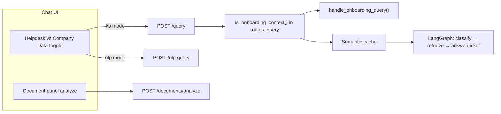
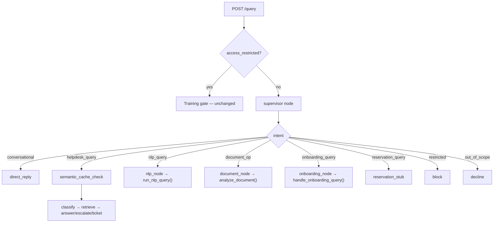

# Supervisor Agent — Unified Chat Routing

## Current state vs target

**Today**, routing is fragmented across three surfaces:



**Target**: one chat box → one orchestrator → Supervisor picks intent → existing pipeline.



---

## Path mapping (your spec → this repo)

| Your spec | Actual location |
|-----------|-----------------|
| `backend/agents/supervisor.py` | [`app/agents/supervisor.py`](app/agents/supervisor.py) (new) |
| `backend/graph/state.py` | [`app/agents/state.py`](app/agents/state.py) |
| `backend/graph/nodes.py` | [`app/agents/supervisor_nodes.py`](app/agents/supervisor_nodes.py) (new — keeps graph readable) |
| `backend/graph/graph.py` | [`app/agents/graph.py`](app/agents/graph.py) |
| `backend/orchestrator.py` | [`app/agents/graph.py`](app/agents/graph.py) `run_pipeline()` |
| `backend/api/routes.py` | [`app/api/routes_query.py`](app/api/routes_query.py) |
| `MODELS["low"]` | `get_settings().classifier_model` via [`app/llm/client.py`](app/llm/client.py) `complete()` |
| `super_admin` role | `admin` (+ `agent` where ticket/NLP access already differs) |

**Do not rewrite** (wrap only): [`app/agents/classifier.py`](app/agents/classifier.py), [`app/agents/retriever.py`](app/agents/retriever.py), [`app/agents/answer.py`](app/agents/answer.py), [`app/agents/ticket.py`](app/agents/ticket.py), [`app/onboarding/onboarding_agent.py`](app/onboarding/onboarding_agent.py), [`app/nlp_query/orchestrator.py`](app/nlp_query/orchestrator.py), [`app/documents/analysis_agent.py`](app/documents/analysis_agent.py).

---

## Intent design (8 intents, adapted to reality)

| Intent | Routes to | Existing code |
|--------|-----------|---------------|
| `conversational` | `direct_reply` | New — cheap `complete()` call |
| `helpdesk_query` | `semantic_cache_check` → existing helpdesk subgraph | Current `classify→retrieve→…` |
| `nlp_query` | `nlp_node` | [`run_nlp_query()`](app/nlp_query/orchestrator.py) + [`evaluate_access()`](app/nlp_query/access_agent.py) |
| `document_op` | `document_node` | [`analyze_document()`](app/documents/analysis_agent.py) via [`get_active_document()`](app/documents/session_store.py) |
| `onboarding_query` | `onboarding_node` | [`handle_onboarding_query()`](app/onboarding/onboarding_agent.py) |
| `reservation_query` | `reservation_stub` | Stub only (matches My Workspace “Guesthouse — coming soon”) |
| `restricted` | `block` | Hardcoded denial (complements training gate + NLP access blocks) |
| `out_of_scope` | `decline` | Hardcoded redirect |

### Document operation ID mapping

Supervisor prompt uses names that differ from the codebase — normalize in `supervise()`:

| Supervisor `document_operation` | Codebase op id |
|--------------------------------|----------------|
| `summarize` | `summarize` |
| `takeaways` | `takeaways` |
| `action_items` | `actions` |
| `explain_simply` | `explain` |
| `find_risks` | `risks` |
| `ask_question` | `ask` |
| `add_to_kb` | `push_to_kb` (admin only) |

Rule from your spec: if `document_op` but **no active document** for the session → downgrade to `conversational` (bot invites upload).

### Onboarding window

Your prompt says **30 days**; config is [`onboarding_window_days = 7`](app/config.py). **Use the config value** in the supervisor context string and post-LLM validation (reuse logic from [`is_onboarding_context()`](app/onboarding/onboarding_agent.py)) so prompt and enforcement stay aligned. Optionally add `SUPERVISOR_ONBOARDING_DAYS` env if you want a longer routing window than reminder window.

### Roles

Use actual JWT roles: `employee`, `agent`, `admin`. Post-LLM `_is_restricted()` runs for `employee`; `agent`/`admin` skip obvious admin-dump patterns unless query is clearly abusive (reuse patterns from [`app/nlp_query/rules.py`](app/nlp_query/rules.py) where overlap exists).

---

## New file: [`app/agents/supervisor.py`](app/agents/supervisor.py)

Core exports:

- `INTENTS`, `DOCUMENT_OPERATIONS`, `SUPERVISOR_SYSTEM` (your prompt, adjusted for 3 roles + config-driven onboarding days)
- `supervise(query, user_role, user_email, has_document, joining_date, onboarding_active) -> dict`
- `_keyword_fallback()` — mirrors your keyword rules; default `helpdesk_query`
- `_is_restricted()` — hard-coded injection/admin-dump patterns (second safety layer)
- `_normalize_document_operation()` — maps spec names → codebase ids
- `_validate_onboarding_intent()` — if LLM says `onboarding_query` but employee is not in onboarding context, downgrade to `helpdesk_query`

LLM call pattern (match existing agents):

```python
from app.llm.client import cached_system, complete
from app.config import get_settings

result = complete(
    model=get_settings().classifier_model,
    system=cached_system(SUPERVISOR_SYSTEM),
    messages=[{"role": "user", "content": context_block}],
    max_tokens=200,
)
```

Parse JSON with same defensive pattern as [`classifier.py`](app/agents/classifier.py) `_parse_classification`.

---

## State extension: [`app/agents/state.py`](app/agents/state.py)

Add fields (all optional / `total=False`):

```python
# Supervisor output
intent: str
intent_confidence: str
intent_reason: str
document_operation: Optional[str]

# User / session context
user_role: str
joining_date: Optional[str]
document_id: Optional[str]
has_document: bool
onboarding_active: bool
```

Keep all existing helpdesk fields unchanged so downstream nodes stay compatible.

---

## New nodes: [`app/agents/supervisor_nodes.py`](app/agents/supervisor_nodes.py)

| Node | Behavior |
|------|----------|
| `supervisor_node` | Calls `supervise()`, writes intent fields to state |
| `direct_reply_node` | Haiku-style `complete()` — warm conversational reply |
| `block_node` / `decline_node` | Fixed strings from your spec |
| `semantic_cache_check_node` | Move logic from [`routes_query.py`](app/api/routes_query.py) lines 262–299; on hit set `answer` + `cached=True` and route to END |
| `onboarding_node` | Calls `handle_onboarding_query()` with state fields; maps result back to `HelpdeskState` |
| `nlp_node` | Calls `run_nlp_query()`; maps `answer`, `model_used`, `token_usage`; sets `intent` metadata for audit |
| `document_node` | Loads active doc for `session_id`, calls `analyze_document(op, text, question=query)` |
| `reservation_stub_node` | “Guesthouse reservations are coming soon…” (links to My Workspace module) |

Helpdesk subgraph nodes (`classify`, `retrieve`, `escalate`, `answer`, `create_ticket`) remain **unchanged**.

---

## Graph restructure: [`app/agents/graph.py`](app/agents/graph.py)

1. Change entry: `START → supervisor` (not `classify`)
2. Add `route_after_supervisor(state) -> str` with your 8-way map; default fallback `helpdesk_query`
3. Wire `helpdesk_query → semantic_cache_check`:
   - cache hit → `END`
   - cache miss → `classify` (existing edges)
4. Terminal edges: all non-helpdesk nodes → `END`
5. Expand `run_pipeline()` initial state to accept `user_role`, `joining_date`, `document_id`, `has_document`, `onboarding_active`

**Remove** duplicate onboarding branch from [`routes_query.py`](app/api/routes_query.py) once supervisor handles `onboarding_query`.

---

## API layer: [`app/api/routes_query.py`](app/api/routes_query.py)

Simplified flow:

1. Session resolve + save user message (unchanged)
2. **Training gate** (`access_restricted`) — stays **before** supervisor (not an intent)
3. `normalize_query()`
4. Enrich context:
   - `user_role` from JWT
   - `joining_date` + `onboarding_active` from [`app/onboarding/store.py`](app/onboarding/store.py) `get_employee()`
   - `has_document` / `document_id` from [`get_active_document(session_id)`](app/documents/session_store.py)
5. Single `run_pipeline(...)` call
6. Map graph result → `QueryResponse`
7. Audit with **`intent` from supervisor** (`conversational`, `helpdesk_query`, `nlp_query`, etc.) instead of hard-coded `onboarding_query` / `helpdesk_query` branches
8. Parallel `score_prompt()` stays in routes_query (outside graph)

### Extend [`QueryResponse`](app/models/schemas.py)

Add optional fields for unified UI/audit:

```python
intent: Optional[str] = None
intent_confidence: Optional[str] = None
nlp_allowed: Optional[bool] = None   # set when intent == nlp_query
block_kind: Optional[str] = None
```

Keep `/nlp-query` endpoint **temporarily** for backward compatibility; mark deprecated in docstring. Chat UI stops calling it.

---

## UI: unified chat ([`app/static/app.js`](app/static/app.js), [`index.html`](app/static/index.html))

- Remove Helpdesk / Company Data toggle ([`#chat-mode-kb`](app/static/index.html), `#chat-mode-nlp`)
- `ask()` always POSTs to `/query`
- Replace `showMeta` / `showNlpMeta` branching with one handler keyed on `data.intent`:
  - `helpdesk_query` → show existing KB meta strip
  - `nlp_query` → hide meta strip (current NLP behavior)
  - others → hide or minimal meta
- Document panel: keep upload UI; when user types in chat with active doc, supervisor routes `document_op` automatically (remove `_docAskMode` shortcut or keep as UX hint that pre-selects `ask` operation)
- Bump static cache-bust query params

---

## Testing strategy

### Phase A — Supervisor unit tests (gate before graph wiring)

New [`tests/test_supervisor.py`](tests/test_supervisor.py) with your 16 cases (+ 2 onboarding-window edge cases):

- Mock `complete()` to return fixed JSON (pattern from [`tests/test_core.py`](tests/test_core.py))
- Test keyword fallback when LLM fails
- Test `_is_restricted()` overrides LLM
- Test document_op downgrade when `has_document=False`
- Test onboarding downgrade when `onboarding_active=False`

### Phase B — Graph integration tests

Extend [`tests/test_core.py`](tests/test_core.py) / new `tests/test_supervisor_graph.py`:

- `route_after_supervisor` maps all 8 intents
- helpdesk path still creates ticket on KB miss
- onboarding path does **not** create ticket for “first day” checklist question
- nlp path returns blocked answer for employee ops question

### Phase C — API test

One `POST /query` test per intent (mock LLM supervisor + downstream as needed).

---

## Rollout order (matches your “supervisor first, then graph” instruction)

1. **`supervisor.py` + unit tests** — all cases green before graph changes
2. **`state.py` + `supervisor_nodes.py`** — stub/reservation + block/decline/direct_reply
3. **`graph.py`** — supervisor entry + routes; helpdesk subgraph unchanged
4. **`routes_query.py`** — remove onboarding branch; enrich state; audit intent
5. **UI** — remove mode toggle; single `/query`
6. **QueryResponse schema** + frontend meta handling
7. Deprecate chat usage of `/nlp-query` (endpoint remains for API consumers)

---

## Risks and mitigations

| Risk | Mitigation |
|------|------------|
| Supervisor misroutes NLP ↔ helpdesk | Keyword fallback + conservative prompt rule #1; log `intent_confidence=low` |
| Double restriction (supervisor block vs NLP access_agent) | Supervisor `restricted` catches obvious dumps; NLP node still runs `evaluate_access()` |
| Onboarding questions opening tickets | `onboarding_node` uses checklist/task guidance before RAG (recent fix in onboarding_agent) |
| Semantic cache skipped for multi-turn | Keep current rule: cache only when `not has_prior` history |
| Latency (+1 Haiku call per message) | Use `classifier_model`; run `score_prompt` in parallel with graph invoke |

---

## Files touched (summary)

**New**
- [`app/agents/supervisor.py`](app/agents/supervisor.py)
- [`app/agents/supervisor_nodes.py`](app/agents/supervisor_nodes.py)
- [`tests/test_supervisor.py`](tests/test_supervisor.py)
- [`tests/test_supervisor_graph.py`](tests/test_supervisor_graph.py) (optional split)

**Updated**
- [`app/agents/state.py`](app/agents/state.py)
- [`app/agents/graph.py`](app/agents/graph.py)
- [`app/api/routes_query.py`](app/api/routes_query.py)
- [`app/models/schemas.py`](app/models/schemas.py)
- [`app/static/app.js`](app/static/app.js)
- [`app/static/index.html`](app/static/index.html)

**Untouched (wrapped only)**
- Classifier, retriever, answer, ticket, cache, KB, onboarding, NLP, document pipelines
